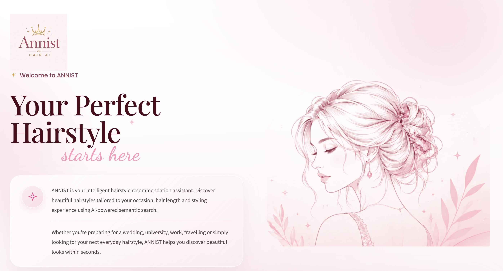
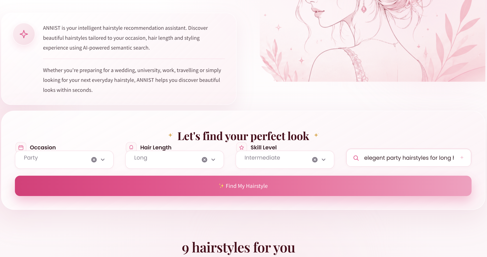
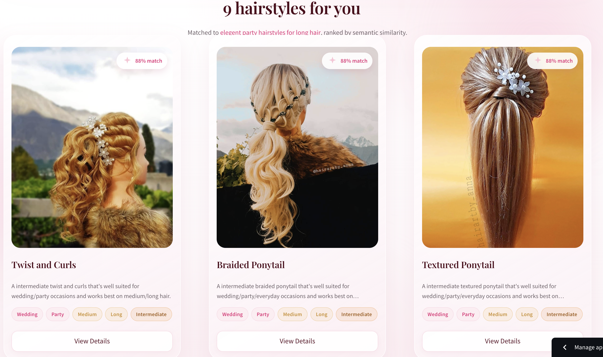

# ✨ ANNIST – AI Hairstyle Recommendation System

ANNIST is an AI-powered hairstyle recommendation system that helps users discover hairstyles based on natural language descriptions.

Instead of browsing hundreds of hairstyle images manually, users simply describe the hairstyle they are looking for, and ANNIST uses semantic search with transformer embeddings to recommend the most relevant hairstyles.

---

## 🌐 Live Demo

https://annist-ai-hairstyle-recommender-izpdhgmqjjgwi7m3mxcqqj.streamlit.app/

---
## 📸 Application Screenshots

### 🏠 Home Page

The ANNIST landing page provides a clean and modern interface for exploring AI-powered hairstyle recommendations.



---

### 🔍 Search Interface

Users can describe their desired hairstyle and refine recommendations using occasion, hair length, and skill-level filters.



---

### 🤖 AI Recommendation Results

ANNIST uses semantic search to recommend relevant hairstyles based on the user's preferences and displays matching hairstyle results.



### 🔍 Search Interface

Users can describe the hairstyle they are looking for and refine their search using occasion, hair length, and difficulty filters.


---

### 🤖 AI Recommendation Results

ANNIST uses semantic search to recommend the most relevant hairstyles based on the user's query, displaying AI match scores and hairstyle details.


## 📂 GitHub Repository

https://github.com/annazaman0101-lab/annist-ai-hairstyle-recommender

---

## 📌 Features

- AI-powered hairstyle recommendations
- Semantic search using Sentence Transformers
- Natural language search
- Occasion filtering
- Hair length filtering
- Difficulty filtering
- Responsive luxury Streamlit interface
- Fast similarity search using cosine similarity
- Image-based hairstyle gallery
- Modern editorial UI design

---

## 🧠 AI Technologies Used

- Sentence Transformers
- all-MiniLM-L6-v2
- Transformers
- PyTorch
- Cosine Similarity
- Semantic Embeddings

---

## 🛠 Tech Stack

### Frontend

- Streamlit 1.37.1
- HTML
- CSS

### Backend

- Python 3.11

### Machine Learning

- Sentence Transformers
- Hugging Face Transformers
- PyTorch
- Scikit-learn

### Data Processing

- NumPy
- Pandas

---

## 📁 Project Structure

```
ANNIST/

│
├── app.py
├── components.py
├── semantic_search.py
├── utils.py
├── generate_embeddings.py
├── requirements.txt
│
├── assets/
│   ├── logo.png
│   ├── background.png
│   └── hero_illustration.png
│
├── data/
│   └── annist_dataset.csv
│
├── embeddings/
│   └── annist_embeddings.npy
│
├── images/
│   └── hairstyle images
│
└── README.md
```

---

## ⚙️ Installation

Clone the repository

```bash
git clone https://github.com/annazaman0101-lab/annist-ai-hairstyle-recommender.git
```

Move into the project

```bash
cd annist-ai-hairstyle-recommender
```

Create a virtual environment

```bash
python3.11 -m venv venv
```

Activate it

Mac/Linux

```bash
source venv/bin/activate
```

Windows

```bash
venv\Scripts\activate
```

Install requirements

```bash
pip install -r requirements.txt
```

Run the application

```bash
streamlit run app.py
```

---

## 🔍 How It Works

1. User enters a hairstyle description.
2. The query is converted into a semantic embedding using Sentence Transformers.
3. Cosine similarity compares the query embedding with all hairstyle embeddings.
4. Filters are applied based on:
   - Occasion
   - Hair Length
   - Difficulty
5. The top matching hairstyles are displayed with similarity scores.

---

## 📊 Dataset

The application uses a custom hairstyle dataset containing:

- Hairstyle name
- Description
- Hair length
- Occasion
- Difficulty
- Image filename

Embeddings are generated offline using Sentence Transformers and stored as NumPy arrays for efficient retrieval.

---

## 🚀 Future Improvements

- Face shape detection
- Hair colour recommendations
- Image upload for hairstyle suggestions
- Personalized user profiles
- Hairstyle bookmarking
- Mobile application
- Multi-language support

---

## 👨‍💻 Author

Developed as the final AI Bootcamp project.
